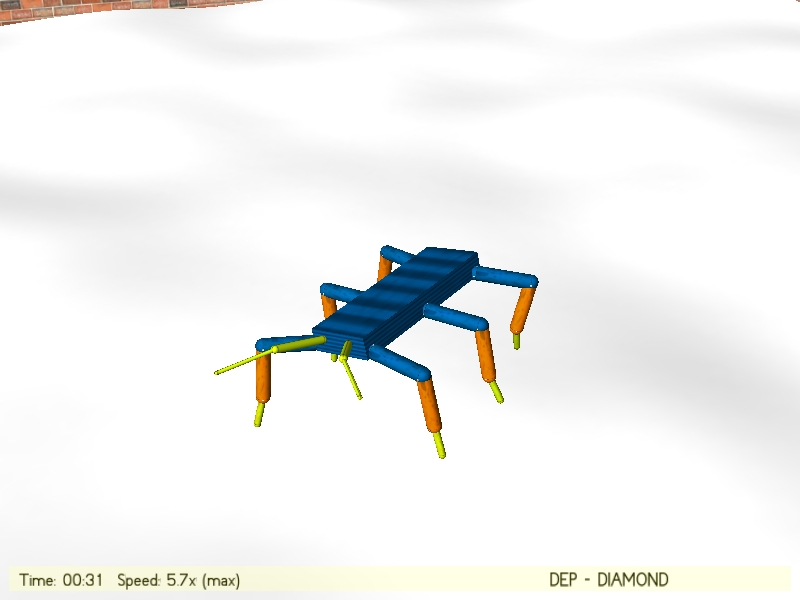
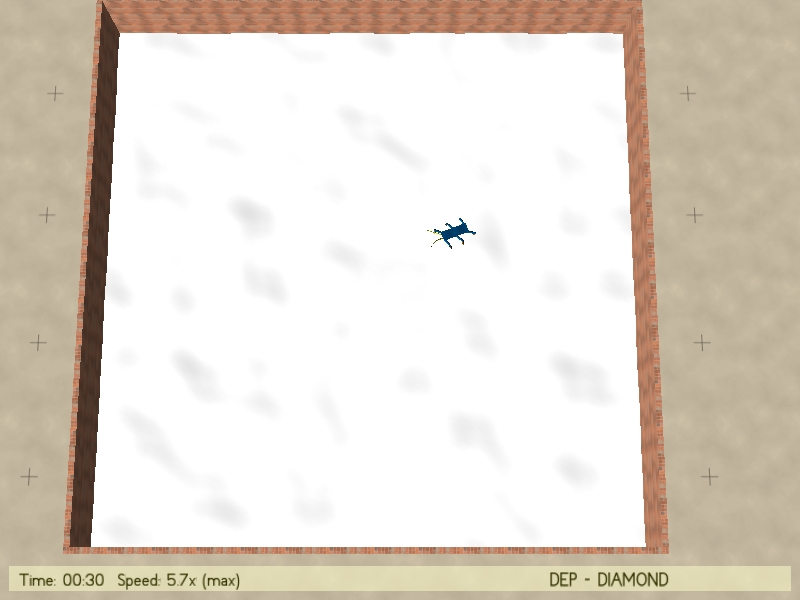
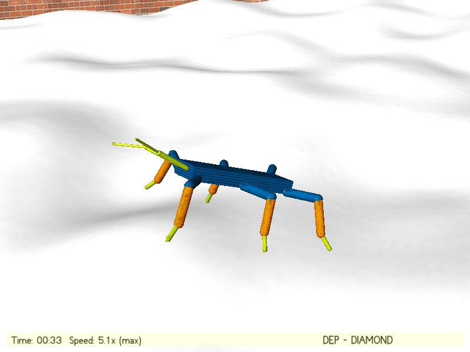
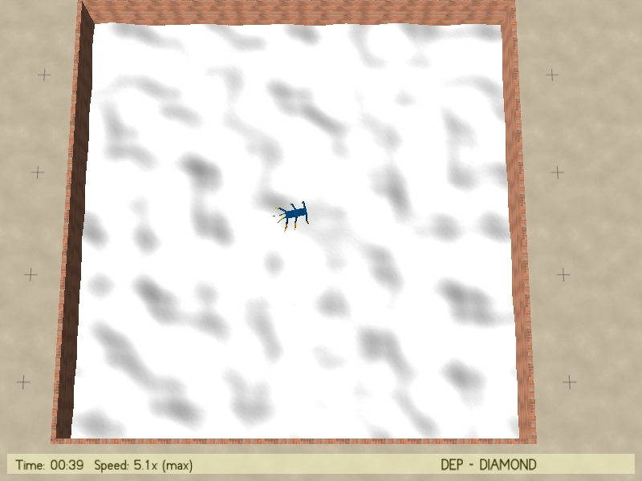
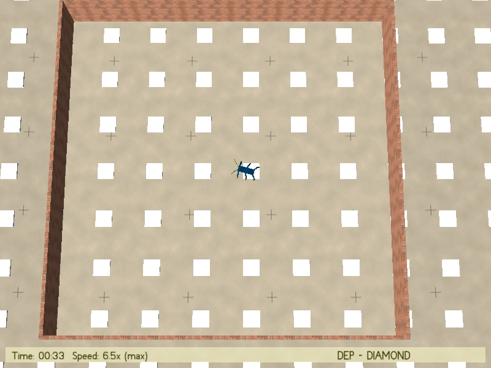
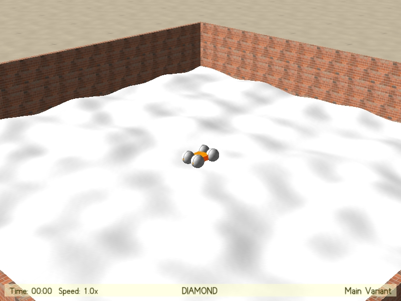
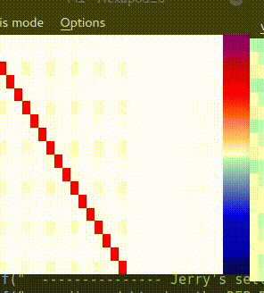
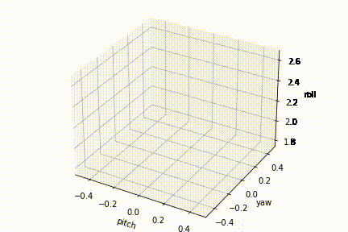
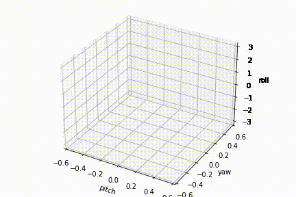

# DEP-Diamond

## Demo


[**Variablity of Locomotion Behaviour**](https://youtu.be/mzOExz9ZQ1Y)     |  [**Exploration on another map**](https://youtu.be/O-f0Nj2gzkk)
:------------------------------------:|:-------------------------------------------:
[](https://youtu.be/mzOExz9ZQ1Y) |  [](https://youtu.be/O-f0Nj2gzkk)


## Experiments

```./start -m 5 -diamond -layers 2 -period 2 -g -config config1.txt```


```./start -set "{synboost=0.1 urate=10.0 epsh=0.1 timedist=4 delay=4}" -m 5 -diamond -layers 2 -period 2 -g -config config1.txt -f 1 ```

```
./start -m 5 -diamond -layers 2 -period 2 -g -config config1.txt -log -simtime 30 -playground 0.25 -terrain 1 -seed 999 -realtimefactor 2

```

```
./start -m 5 -diamond -layers 2 -period 2 -g -config config1.txt -log -simtime 30 -playground 0.25 -terrain 1 -seed 999 -realtimefactor 0 -topview

```

### Tasks (Besides complex terrain mapGen)

Climbing up stairs:

```
./start -m 5 -diamond -layers 2 -period 2 -g -config config1.txt -log -simtime 30 -playground 0.15 -seed 100 -realtimefactor 0 -topview
```

without the -terrain 1 (mapGen) and also should be with lower stairs(such as 0.15 in this case)


## Demo pics:


**less difficult uneven terrain**     |  **less difficult uneven terrain topdown**
:------------------------------------:|:-------------------------------------------:
 |  


**more difficult uneven terrain**     |  **more difficult uneven terrain topdown**
:------------------------------------:|:-------------------------------------------:
 |  


**stairs**     |  **four wheeled flipper robot**
:------------------------------------:|:-------------------------------------------:
 |  


<!---

**less difficult uneven terrain**


**less difficult uneven terrain topdown**


**more difficult uneven terrain**


**stairs**


**four wheeled flipper robot**


-->


## Matrix Evaluations


**Second layer model matrix M2**     |  **Second layer controller matrix C2**
:-----------------------------------:|:-------------------------------------------:
                  |  


**First layer model matrix M1**      |  **First layer model matrix C1**
:-----------------------------------:|:-------------------------------------------:
                  |  


These two models M1 and M2 are set with identity matrix, with a very small learning rate. However, the second layer model M2 has a relatively larger learning rate because inner model should be adaptablely learnt by itself and fixed by itself.

<br/><br/>

## Behaviour Evaluations

**Correlations and Coverage of Euler angles** (Pitch, yaw, Roll) in 3D space:


**intense behaviour correlations**   |  **behaviour change**
:-----------------------------------:|:-------------------------------------------:
                  |  


## Videos:

**Behaviour varieties emerge in different trails** with different parameters:

https://youtu.be/LsKGFznstgI

In just a single experiments, see the correlations of the **Euler Angles** with the minor generated behaviour changes/adaptance:

https://youtu.be/1zWCGcqoexE


Also see my previous simulations on 'flippable' **fourwheeled robot**:

https://youtu.be/9pa87s2gzj0


## Parameters. All the command line options:

    --------------- Specific settings for this simulation ------------    
-walkmodel    initialize model to contain additional connections, see following switches:    
-walkdelay    add connections for leg oscillation    
-tripod    add connections for full tripod gait    
-tripod_neg    add only negative connections for subsequent legs for tripod    
-lateral_neg    add negative connections for lateral leg pairs    
-leg_delay    add connections to delay subsequent legs on each side    
          END OF MODEL SWITCHES    
-babbling STEPS    start with # STEPS in motor babbling mode (robot fixed)    
-boxpile    add a boxpile to the scene    
-randomctrl    initialize the C matrix randomly (with urate=0 this is static)    
    --------------- Misc stuff ------------    
-numwalls N    add N surrounding walls around robot    
-track FILENAME    record trajectory of robot into file    
-loadcontroler FILE     load the controller at startup    
-height HEIGHT     set initial height of robot    
-noisecontrol TAU     use noise as motor commands with correlation length 1/TAU     
-sine    use sine controller    
-whitenoise    use white noise instead of colored noise for sensor noise (only active if paramter noise!=0)    

    --------------- Jerry's settings ------------    
-**diamond**     using the DEP-Diamond model    
-**config** FILENAME    config files of all controller layer parameters to load in    
-**layers** NUM_of_LAYER     using Number_of_Layer in the diamond model with config detailed parameters    
-**playground** BOOL     use the playgruond box area or not    
-**zsize** DIFFICULTY     the terrian map difficulty, max height     
-**topview**    camera top-down view    
-**realtimefactor** SPEED    use using a speed of SPEED(or max with 0) in simulation    
-**period** TIME_AVG     time-sliding window(period) for the second layer Time-loop error as input     
-**seed** SEED     the terrian map seed for generation with Perlin noise    

## The structure of the ```config.txt``` file is like this:
An example is shown [here](./simulations/hexapod_simulation/config1.txt).

You can write any command lines in the config file, the self-designed parse will parse all comands or spaces.

```
# Parameters for Layer 1:
l1_epsM = 0.001
l1_epsh = 0.000
l1_synboost = 1.1
l1_urate = 0.05
l1_indnorm = 1
l1_timedist = 4
l1_learningrule = 3
l1_time_average = 1

# Layer 2 Parameters
l2_epsM = 0.005
l2_epsh = 0.000
l2_synboost = 1.1
l2_urate = 0.1
l2_indnorm = 1 
l2_timedist = 8
l2_learningrule = 3
l2_time_average = 2
```

# Git COMMANDS:

``` git add . ```

```git commit -m "adding changeable terrain map for exploration and adaption in the complex terrain"```

``` git push -u origin main ```


# Reference 

1. using the learning rules from the paper 

DEP rule: https://www.pnas.org/content/112/45/E6224

Supplementary materials: playfulmachines.com/DEP  (Ralf Der et al)

2. using the diamond structure introduced here:

DIAMOND rule: https://www.frontiersin.org/articles/10.3389/fnbot.2020.00062/full   (Simon et al)

3. Simulator: 

Lpzrobot software: https://github.com/georgmartius/lpzrobots  (Georg Martius et al)

Installation Scripts: https://github.com/larsgroeber/lpzrobots-install-script

